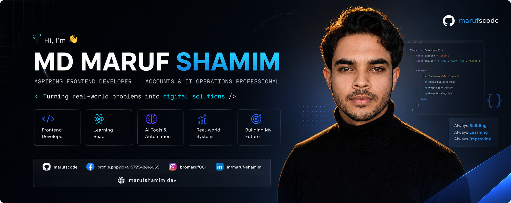

 

📍 Daudkandi, Cumilla, Bangladesh&nbsp;&nbsp;•&nbsp;&nbsp;🧑 He/Him&nbsp;&nbsp;•&nbsp;&nbsp;🌐 <a href="https://marufshamim.dev/">marufshamim.dev</a>

---

## 👤 About Me

I'm **MD Maruf Shamim** — also known as **MD Maruf Khan** — a developer based in Daudkandi, Cumilla, Bangladesh.

I bring hands-on experience in **Accounts & IT Operations**, where I've worked with real-world IT and operational systems and built a strong foundation in structured, practical problem-solving. I'm now channeling that experience into software development — learning **React**, modern JavaScript, and frontend engineering while building real, working digital solutions.

I'm not claiming to be an expert — I'm a developer in progress: consistent, curious, and serious about growing into a capable Software Developer.

- 🎓 Studied at **Genex Model School**
- 💼 Background in **Accounts & IT Operations**
- 🌐 Portfolio — [marufshamim.dev](https://marufshamim.dev/)

---

## 🎯 Current Focus

 

---

## 🛠️ What I Do

**💻 Frontend Development**
Building responsive, user-friendly interfaces with modern HTML, CSS, and JavaScript.

**🏢 IT & Operations**
Working with real-world IT and operational systems through my Accounts & IT Operations background.

**🤖 Automation & AI**
Exploring AI-powered developer tools and automation to work smarter and ship faster.

**🧩 Problem Solving**
Turning practical, everyday problems into working digital solutions.

---

## 🧰 Tech Stack

**Frontend**

*React — currently learning*

**Tools & Platforms**

**AI & Productivity**

---

## 📈 Development Journey

- 🌱 Learning **React** and component-based frontend architecture
- 🎨 Practicing **responsive UI design** with Tailwind CSS & Bootstrap
- 🤖 Exploring **AI-powered developer tools** to speed up my workflow
- 🧠 Strengthening my **JavaScript & TypeScript** fundamentals
- 🚀 Applying everything by building small, practical projects

---

## 🚀 Projects

**🚀 Project Name**
Short description of what this project does.
**Tech Stack:** `HTML` `CSS` `JavaScript`
[Live Demo](#) • [Repository](#)

> 📌 More projects are being built and will be added here soon.

---

## 📊 GitHub Stats

## 🔥 Contribution Streak

<h3 align="left">Languages and Tools:</h3>

         <a href="https://www.adobe.com/products/xd.html" target="_blank" rel="noreferrer"> 

---

## 🤝 Connect With Me

---

## 🎯 Current Goal

> To become a skilled Software Developer and build practical digital solutions for real-world problems — one project, one skill, one commit at a time.

---

**"Turning real-world problems into digital solutions."**
*Always Building • Always Learning • Always Improving*

